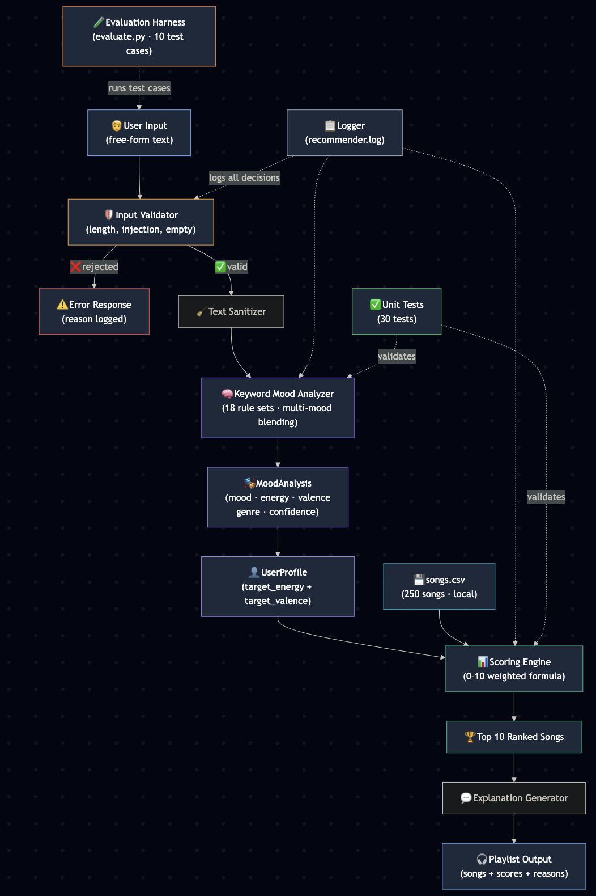

# CodePath AI110 Final Project, Extension of AI Music Mood Recommender

An AI-powered music recommendation system that detects your mood from natural language text and generates personalized playlists. Everything runs locally — no external APIs, no cloud services. Just Python, your words, and a 250-song catalog.

Built as a final project for **AI110: Foundations of AI Engineering** (CodePath, Spring 2026).

---

## 📌 Base Project

This project extends **Project 3: Music Song Recommender**. The original system scored songs using a weighted formula based on manually defined user profiles where users had to specify numerical parameters like `target_energy: 0.8` and `favorite_genre: "lofi"`. This extension replaces manual configuration with natural language mood detection — you just describe how you feel, and the system figures out the rest.

---

## 🎯 Title and Summary

**AI Music Mood Recommender** takes free-form text like *"I just had a terrible breakup and can't stop crying"* and analyzes it to detect emotional parameters (mood: melancholic, energy: 30%, valence: 25%, genre: indie folk). These parameters feed into a weighted scoring engine that ranks 250 songs and returns a personalized 10-track playlist with human-readable explanations for each recommendation.

The system supports multi-mood blending (e.g., "sad but also angry" averages both profiles), includes input validation guardrails, confidence scoring on every analysis, and a full evaluation harness that verifies consistent behavior across predefined test cases. A web frontend provides a visual interface with a toggleable debug panel showing the step-by-step processing pipeline.

---

## 🏗️ Architecture Overview



The system follows a linear pipeline with a testing layer:

**User Input** → **Input Validator** (guardrails check length, emptiness, injection patterns) → **Text Sanitizer** (strips HTML, normalizes whitespace) → **Keyword Mood Analyzer** (18 rule sets with multi-mood blending — matches emotional keywords to parameters) → **MoodAnalysis** (detected mood, energy, valence, genre, acoustic preference, confidence score) → **UserProfile Conversion** (maps mood analysis to target_energy + target_valence) → **Scoring Engine** (0–10 weighted formula run against all 250 songs from songs.csv) → **Explanation Generator** (human-readable reasons for each match) → **Playlist Output** (top 10 ranked songs with scores and explanations)

Every decision is logged to `recommender.log`. The evaluation harness (`evaluate.py`) runs 10 predefined test cases through the full pipeline, and 30 unit tests validate individual components.

---

## 🚀 Setup Instructions

### Prerequisites
- Python 3.10+
- pip

### Installation

```bash
git clone https://github.com/YOUR_USERNAME/applied-ai-system-project.git
cd applied-ai-system-project
python -m venv .venv
source .venv/bin/activate        # Mac/Linux
# .venv\Scripts\activate         # Windows
pip install -r requirements.txt
```

### Running the System

```bash
# Full CLI demo (profiles + mood detection + guardrails)
python src/main.py

# Evaluation harness (structured pass/fail report)
python evaluate.py

# Run unit tests
python -m pytest tests/ -v

# Web frontend (two terminals)
python src/api.py                # Terminal 1: start backend
open frontend.html               # Terminal 2: open in browser
```

### Project Structure

```
├── src/
│   ├── api.py               # Flask API server (wraps recommender for frontend)
│   ├── main.py              # CLI runner with demo modes
│   └── recommender.py       # Core engine (mood detection, scoring, guardrails)
├── tests/
│   └── test_recommender.py  # 30 unit tests
├── data/
│   └── songs.csv            # 250-song catalog with audio features
├── assets/
│   └── architecture-diagram.png
├── evaluate.py              # Evaluation harness (10 test cases)
├── frontend.html            # Web UI with debug panel
├── model_card.md            # Reflections, ethics, AI collaboration
├── requirements.txt
└── README.md
```

---

## 💬 Sample Interactions

### Example 1: Heartbreak (single mood)
```
📝 "I just had a terrible breakup and I can't stop crying"
─────────────────────────────────────────────────
   Detected mood:   melancholic
   Energy level:    30%
   Valence:         25%
   Suggested genre: indie folk
   Confidence:      55%
   Reasoning:       Keyword matches: heartbreak, cry
─────────────────────────────────────────────────
   #1 Autumn Leaves — Acoustic Dreams       7.2/10  genre match + acoustic vibes
   #2 Heartstrings — Luna Rivers            6.9/10  acoustic vibes
   #3 Paper Boats — Acoustic Dreams         6.8/10  genre match + acoustic vibes
```

### Example 2: Mixed moods (multi-mood blending)
```
📝 "I feel focused but also sad and lonely"
─────────────────────────────────────────────────
   Detected mood:   melancholic
   Energy level:    33%
   Valence:         35%
   Suggested genre: indie folk
   Confidence:      75%
   Reasoning:       Blended moods: melancholic + focused (keywords: sad, lonely, focus)
─────────────────────────────────────────────────
   #1 Mountain Echo — Indie Folk             7.0/10  genre match
   #2 Firefly — Acoustic Dreams              6.9/10  genre match + acoustic vibes
   #3 Paper Boats — Acoustic Dreams          6.9/10  genre match + acoustic vibes
```

### Example 3: Guardrail rejections
```
Test: Empty input
  🚫 Rejected: Input text is empty

Test: Script injection attempt
  🚫 Rejected: Input contains disallowed content

Test: Unrecognized keywords
  ⚠️ Low confidence (15%) — "No recognized mood keywords found —
  try describing your feelings with words like happy, sad, angry,
  chill, focused, tired, excited, etc."
```

---

## 🧠 Design Decisions

**Why keyword-based analysis instead of an LLM?** The keyword system runs with zero latency, zero cost, and zero external dependencies. It's fully deterministic, the same input always produces the same output, which makes testing straightforward and behavior predictable. The 18 rule sets cover the most common emotional expressions, and multi-mood blending handles complex inputs like "sad but also angry."

**Why a 0–10 weighted scoring formula instead of embeddings?** The scoring formula is fully transparent. Users can see exactly why each song was recommended: genre match (+3), mood match (+2), energy similarity (up to +2), valence similarity (up to +1.5), danceability (up to +1), acoustic bonus (+0.5). This supports the requirement for clear explanation of how the AI works. Embedding-based approaches would be more powerful but less explainable.

**Why separate target_energy and target_valence?** An earlier version used `target_energy` for both energy and valence comparisons, which meant sad inputs (low valence) were scored the same as calm inputs (low energy). Separating the two means "sad but focused" correctly favors songs that are low positivity but medium energy, rather than just low energy across the board.

**Why input validation as a separate layer?** Separating guardrails from business logic follows defensive programming principles. The validator catches malformed, empty, or unsafe inputs before they reach the mood analyzer, preventing garbage-in-garbage-out failures and logging every rejection for debugging.

---

## 🧪 Testing Summary

**30 unit tests** covering all components — 100% pass rate.

**10 evaluation harness cases** — all passed, 100% pass rate, 62% average confidence.

| Area | Tests | Result |
|------|-------|--------|
| Mood keyword analysis | 6 | All pass |
| Multi-mood blending | Covered in mood tests | All pass |
| Input validation / guardrails | 5 | All pass |
| Scoring logic | 4 | All pass |
| Recommendation ranking | 3 | All pass |
| Explanation generation | 4 | All pass |
| Full pipeline (text → recs) | 4 | All pass |
| Data class conversions | 2 | All pass |
| Functional API backward compat | 1 | All pass |
| Evaluation harness (evaluate.py) | 10 cases | All pass |

The system handled edge cases well: neutral text without mood keywords defaults to "chill/lofi" with a 15% confidence and a helpful suggestion to rephrase. Multimood inputs like "sad but also angry" correctly blend energy parameters (0.30 + 0.90 → 0.70). Script injection is caught and rejected. The low-confidence warning guides users toward better phrasing rather than silently returning bad results.

---

## 🔮 Reflection

Building this project taught me that reliability engineering matters more than model sophistication. The keyword analyzer is conceptually simple, but making it trustworthy required input validation, confidence scoring, graceful fallbacks, multi-mood handling, clear explanations, comprehensive tests, and structured logging. These practices are what make an AI system safe to actually deploy. I now think of AI engineering less as "making the AI smarter" and more as "making the system honest about what it knows and doesn't know."

The valence bug was a particularly good lesson. Although the system looked correct because it returned plausible songs, but it was completely ignoring positivity/negativity in its scoring. Only by human testing and the use of specific edge cases ("focused but sad") did the bug become visible. This reinforced why structured evaluation matters more than spot checking.

---

## 🎥 Demo Walkthrough

(https://www.loom.com/share/990270418b684b8d9968605875c793a3)

